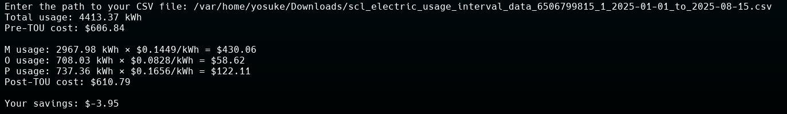

# sclcalc
Calculates savings by switching to Seattle City Light's Time-of-Use rates.

## How to Use

### 1. Download your data from Seattle City Light
a. Log into your SCL account and click on "View Usage Details".

b. Click on "View Usage Details"" tab on the following screen.

c. Click on the "Green Button / Download my data" on the lower right of the screen.

d. On the following screen, select the option for "Export usage for a range of days". Ensure the "CSV" Format is selected, and click "Export". Note: currently this tool is most accurate if the date range falls in 2024 or 2025.

e. A .zip file will be downloaded to your computer. Extract the .zip file. You should have a file named "scl_electric_usage_interval_data_... .csv"

### 2. Download the python script
From this GitHub page, go to "Code" and "Download Zip". Extract the zip file (sclcalc-main.zip) that is downloaded.

### 3. Running the script

#### Linux and MacOS
a. Open a terminal window and navigate to the directory in which the script you downloaded and extracted is. 

b. Run by typing `python3 sclcalc.py`

c. The script will ask for the path to your CSV file that was downloaded from SCL. Enter the full path (e.g. - `/home/<user>/Downloads/scl_electric_usage_... .csv`)

#### Windows
a. Navigate to your Downloads folder, and then to the folder that was extracted from sclcalc-main.zip (e.g. - C:\Users\<user>\Downloads\sclcalc-main\sclcalc-main)

b. Right click in the window and select "Open in Terminal"

c. In the command prompt, run `python3`. If you don't have Python installed, the Microsoft Store will open to have you install it. Close the Terminal window.

d. Repeat step (a) and open a new Terminal window in the sclcalc-main folder. Run `python3 sclcalc.py`

e. Enter the path to the downloaded CSV file by finding the file in File Explorer, right-click Copy the file, then Paste into the Terminal window.

